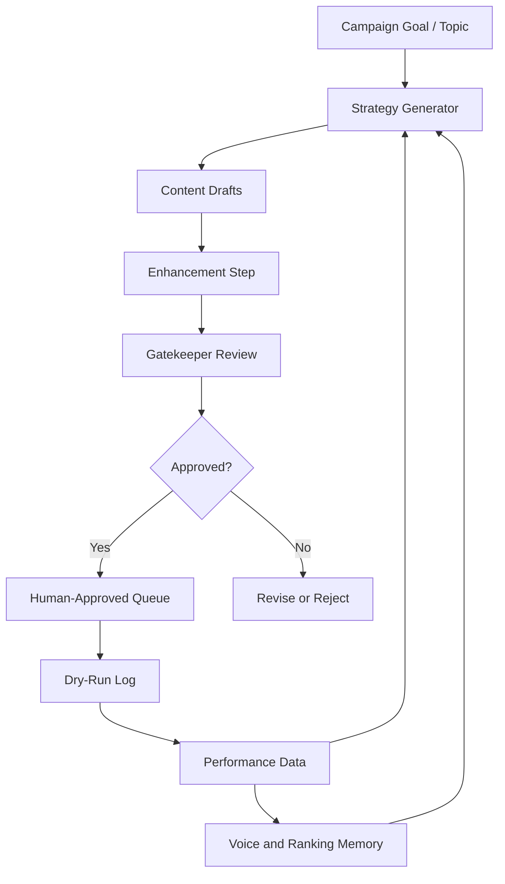

# Kourai Workflow

```mermaid
flowchart TD
    A[Campaign Goal / Topic] --> B[Strategy Generator]
    B --> C[Content Drafts]
    C --> D[Enhancement Step]
    D --> E[Gatekeeper Review]
    E --> F{Approved?}
    F -->|Yes| G[Human-Approved Queue]
    F -->|No| H[Revise or Reject]
    G --> I[Dry-Run Log]
    I --> J[Performance Data]
    J --> B
    J --> K[Voice and Ranking Memory]
    K --> B
```
