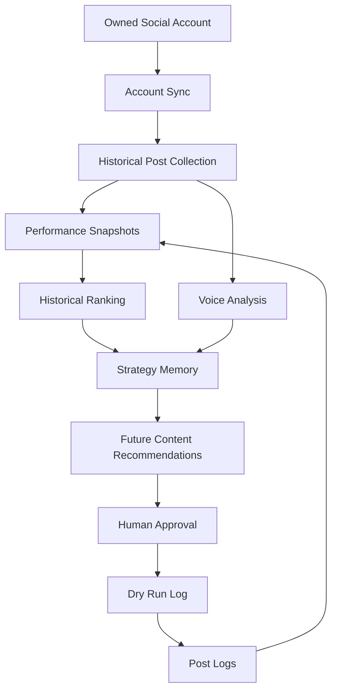

# Learning Loop

```mermaid
flowchart TD
    A[Owned Social Account] --> B[Account Sync]
    B --> C[Historical Post Collection]
    C --> D[Performance Snapshots]
    D --> E[Historical Ranking]
    C --> F[Voice Analysis]
    E --> G[Strategy Memory]
    F --> G
    G --> H[Future Content Recommendations]
    H --> I[Human Approval]
    I --> J[Dry Run Log]
    J --> K[Post Logs]
    K --> D
```
