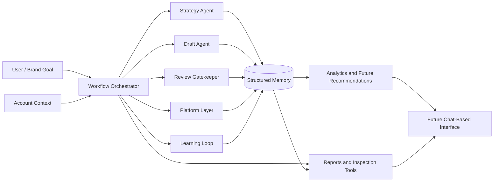

# System Architecture

```mermaid
flowchart LR
    U[User / Brand Goal] --> O[Workflow Orchestrator]
    AC[Account Context] --> O
    O --> S[Strategy Agent]
    O --> D[Draft Agent]
    O --> R[Review Gatekeeper]
    O --> P[Platform Layer]
    O --> L[Learning Loop]
    O --> Q[Reports and Inspection Tools]
    S --> M[(Structured Memory)]
    D --> M
    R --> M
    P --> M
    L --> M
    M --> Q
    M --> A[Analytics and Future Recommendations]
    A --> UI[Future Chat-Based Interface]
    Q --> UI
```
