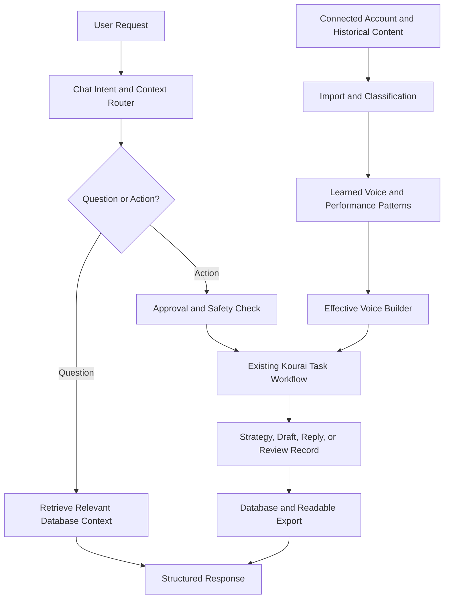

# Architecture Overview

Kourai is organized around database-backed workflows, selective context retrieval, effective voice composition, and approval-based task execution.

## Core Layers

- **Account context:** records connect workflow runs, historical posts, strategies, drafts, replies, reviews, campaigns, and learned voice data to the relevant account and platform context.
- **Historical learning pipeline:** imported social content can be classified by content type and connected to performance signals before voice analysis.
- **Learned and effective voice:** Kourai combines safe defaults, PHINN identity, learned historical patterns, performance context, and user-controlled overrides into context-specific generation guidance.
- **Task orchestration:** supported workflows route through reusable tasks for strategy, post generation, reply generation, enhancement, review, synchronization, and learning operations.
- **Chat orchestration:** natural-language requests are classified into supported intents, matched with relevant database context, and routed as questions or approval-required actions.
- **Safety and approval:** live posting remains disabled during development, and modifying or external actions require confirmation.
- **Persistence and exports:** database records, chat sessions, action records, generation metadata, and readable exports make the local workflow auditable.

The architecture remains a prototype. It demonstrates backend orchestration, context retrieval, persistence, and workflow-control capabilities rather than production deployment.
